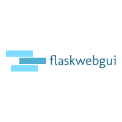

<p align="center">
  
</p>

<p align="center">
  <h2> Create desktop applications with Flask (or Django)!</h2>
  
  [](https://pepy.tech/project/flaskwebgui)

</p>


### Install

```
pip install flaskwebgui
```
Or download source file [flaskwebgui.py](https://raw.githubusercontent.com/ClimenteA/flaskwebgui/master/src/flaskwebgui.py) and place it where you need. 

### Usage with Flask

Add bellow js code to your base.html (or to your script.js file)

```
<script>

document.addEventListener('DOMContentLoaded', function() {

    var url = 'http://127.0.0.1:5001/GUI-is-still-open'; 
    fetch(url, { mode: 'no-cors'});
    setInterval(function(){ fetch(url, { mode: 'no-cors'});}, 5000)();

});

</script>

```

In your main python file add bellow 3 lines of code

```
from flask import Flask
from flaskwebgui import FlaskUI #get the FlaskUI class

app = Flask(__name__)

# Feed it the flask app instance 
ui = FlaskUI(app)

# do your logic as usual in Flask
@app.route("/")
def index():
  return "It works!"

# call the 'run' method
ui.run()

```
### Usage with Django

Make a file 'gui.py'(file name not important) next to 'manage.py' file in the django project folder.

Add the js code like we did it up.

Inside 'gui.py' file add these 2 lines of code:

```

from flaskwebgui import FlaskUI #import FlaskUI class

#You can also call the run function on FlaskUI class instantiation

FlaskUI(server='django').run()

```

Next run from your terminal the bellow command:

```
python gui.py
```

### Configurations

Default FlaskUI class parameters:

* **app**, ==> flask class instance

* **width=800** ==> default width 800

* **height=600** ==> default height 600

* **fullscreen=False** ==> start app in fullscreen

* **maximized=False** ==> start app in maximized window

* **app_mode=True** ==> by default it will start chrome in app(desktop) mode without address bar

* **browser_path=""** ==> path to `browser.exe` (absolute path to chrome `C:/browser_folder/chrome.exe` 

* **server="flask"** ==> the default backend framework is flask (django is suported also), you can add a function which starts the desired server for your choosed framework (bottle, web2py pyramid etc)

* **port=5000** ==> specify other if needed, make sure to add port+1 in the js script

* **socketio=SocketIO Instance** ==> Flask SocketIO instance (if specified, uses `socketio.run()` instead of `app.run()` for Flask application)

Should work on windows/linux/mac with no isssues.

Develop your app as you would normally do, add flaskwebgui at the end or for tests.
**flaskwebgui doesn't interfere with your way of doing a flask application** it just helps converting it into a desktop app more easily with pyinstaller or [pyvan](https://github.com/ClimenteA/pyvan).

### Distribution

You can distribute it as a standalone desktop app with pyinstaller or [pyvan](https://github.com/ClimenteA/pyvan).

### Credits
It's a combination of https://github.com/Widdershin/flask-desktop and https://github.com/ChrisKnott/Eel

flaskwebgui just uses threading to start a flask server and the browser in app mode (for chrome).
It has some advantages over flask-desktop because it doesn't use PyQt5, so you won't have any issues regarding licensing and over Eel because you don't need to learn any logic other than Flask/Django.

**Submit any questions/issues you have! Fell free to fork it and improve it!**


